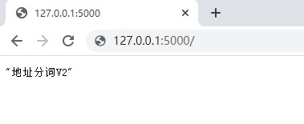
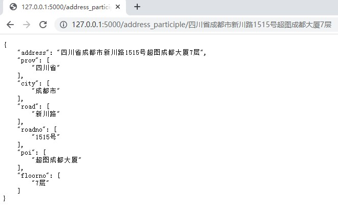
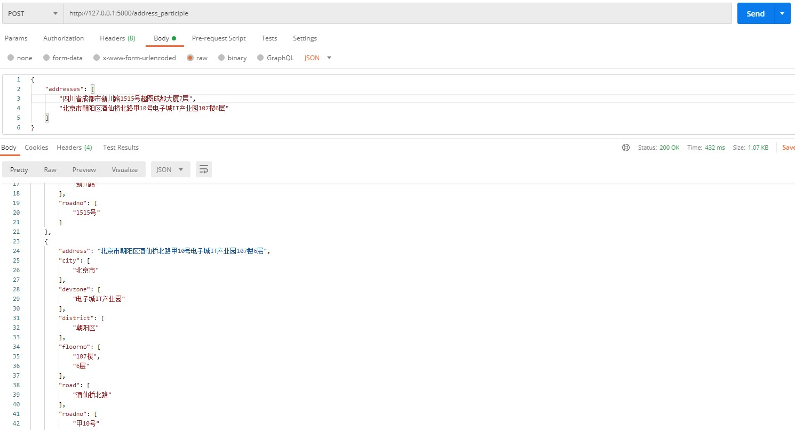
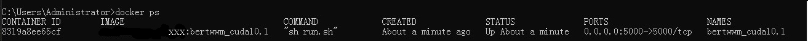

# 1. 项目介绍
## 1.1 介绍
本项目由北京超图软件股份有限公司未来GIS实验室开发并发布。

利用NLP技术构建了一个地址要素解析工具，通过http协议（get、post）接收一条或多条地址，经过模型计算，返回解析后的json格式的结果。

支持cpu与gpu，默认使用0号显卡，gpu不能正常使用自动使用cpu

## 1.2 项目效果
### 1.2.1 简单欢迎界面

### 1.2.2 单条地址通过get请求获得结果

### 1.2.3 多条地址通过pot请求获得结果



## 1.3 可以识别出的地址要素种类
具体标注标准见：./中文地址要素解析标注规范.pdf
```json
{
    "prov":         "省级行政区划，省、自治区、直辖市。",
    "city":         "地级行政区划，地级市、地区、自治州等。",
    "district":     "县级行政区划，市辖区、县级市、县等。",
    "devzone":      "广义的上的开发区，除 国家级、省级等具备一定行政 职能 的开发区外，一般性产业园区、度假区等也应标注为开发区。",
    "town":         "乡级行政区划，镇、街道、乡等。",
    "community":    "包含社区、行政村（生产大队、村委会），自然村",
    "village_group":"限定xxx组、xxx队、xxx社（xxx为数字）",
    "road":         "有正式名称的道路，包括隧道、高架、街、弄、巷等。步行街、商业街、统一标注为road，除非地图上明显表明是ipoi类别（只有一栋楼))；xxx路段、xxx路南段等整体标注为road",
    "roadno":       "路号",
    "intersection": "道路口，口、交叉口、道路（高速）出入口，一定与road同时出现，注意：小区出入口和车库出入口为poi",
    "houseno":      "楼栋号，农村地址的门牌号((包括类似南楼、北楼一类的描述))",
    "cellno":       "单元号,包括“东西”“甲乙丙丁”一类的单元号",
    "floorno":      "楼层号",
    "distance":     "距离",
    "poi":          "兴趣点",
    "subpoi":       "子兴趣点",
    "assist":       "辅助定位",
    "O":            "其它"
}
```
---

# 2. 使用方法
为了屏蔽运行环境在不同机器上的影响，项目采用docker方式部署

目前已在linux与windows10上测试成功。
## 2.1 安装docker
各类操作系统下安装命令略有不同，可自行搜索。以 linux 系统为例：
```bash
sudo curl -sS https://get.docker.com/ | sh
```
如果需要调用gpu，继续执行如下命令以支持gpu调用（以ubutun为例）：
```bash
# Add the package repositories 
distribution=$(. /etc/os-release;echo $ID$VERSION_ID) 
curl -s -L https://nvidia.github.io/nvidia-docker/gpgkey | sudo apt-key add - 
curl -s -L https://nvidia.github.io/nvidia-docker/$distribution/nvidia-docker.list | sudo tee /etc/apt/sources.list.d/nvidia-docker.list 

sudo apt-get update && sudo apt-get install -y nvidia-container-toolkit 
sudo systemctl restart docker
```
Mac OS 和Windows 操作系统可参考官网安装Docker桌面版：

Mac：https://docs.docker.com/docker-for-mac/install/

Windows：https://docs.docker.com/docker-for-windows/install/

---

## 2.2 拉取镜像
目前镜像存放在公有云的镜像仓库中，以直接拉取的方式获得，后期视情况添加本地生成镜像，部署的方式。


| 镜像地址 | 描述 |
| :----- | :----: |
|XXX:bertwwm_cuda10.1|**推荐**，准确率良好，所需硬件配置稍低|
|XXX:uerlarge_cuda10.1|准确率更高，所需硬件配置稍高|

**注意：上述镜像地址并不能直接使用，有需要，请联系未来GIS实验室孙亚松**

首先根据自己机器的配置选择镜像地址

```bash
# 在终端(windows:以管理员身份运行cmd)输入下列命令拉取镜像
# 例如 选择推荐的bertwwm_cuda10.1版本，则输入：
# docker pull XXX:bertwwm_cuda10.1


docker pull [镜像地址]
```

## 2.3 运行容器
docker pull成功后，继续运行下列命令
```bash
# 在终端(windows:以管理员身份运行cmd)继续输入下列命令运行容器, 
# 继续接2.2中的bertwwm_cuda10.1版本，则输入：
# docker run  -p 5000:5000 -dit --name bertwwm_cuda10.1 XXX:bertwwm_cuda10.1


docker run -p [宿主机端口]:5000 -dit --name [容器名称][镜像地址]
```
|命令中可选参数|描述|
| --- | --- |
|宿主机端口号|在本机挑选一个没有被占用的端口，用以转发请求到docker内部|
|容器名称|为新创建的容器起个名字|
---

## 3. 测试是否正常
至此，没有报错的话，地址分词部署完毕，检验方式：
## 3.1 欢迎页面
打开浏览器，输入ip:[宿主机端口号]，可以看到欢迎界面

本机部署，本机测试，采用推荐配置，可以输入 127.0.0.1:5000

## 3.2 以程序的方式测试
仍旧以推荐参数举例
```python
# python示例

import requests


# 1.接口地址,如果端口有变化需要按照需求更改
host = 'http://127.0.0.1:5000'
url = host + "/address_participle"


# 2.单条地址发送请求示例
one_address = "四川省成都市新川路1515号超图成都大厦7层"
one_address_result = requests.get(url + "/" + one_address)


# 3.多条地址采用post请求示例
multi_address = {
    "addresses": [
        "四川省成都市新川路1515号超图成都大厦7层",
        "北京市朝阳区酒仙桥北路甲10号电子城IT产业园107楼6层"
    ]
}
multi_address_result = requests.post(url, json=multi_address)
```

# 4.其他操作
## 4.1 查看容器的状态或信息
```bash
# 在终端中输入下列命令来查看有哪些容器在运行，可能会有多个，可以通过IMAGE,PORTS,NAMES等信息来判断哪个是创建的容器
# 由此可以得到容器的id和name
docker ps
```

上图中

容器的id为8319a8ee65cf

容器的名称为：bertwwm_cuda10.1

容器使用的镜像为：XXX:bertwwm_cuda10.1

容器映射的端口为：将本机的5000端口映射到容器的5000端口

## 4.2 关闭与启动docker
启动容器后，分词服务一直在后台占用资源，但是分词服务不是一直需要，不需要时候如何关闭？ 需要时如何启动？

需要首先知道容器的名称或id(查看方式见4.1)

```bash
# 关闭容器
# 以上图举例：
# docker stop 8319a 或者 docker stop bertwwm_cuda10.1

docker stop [容器name或id]


# 启动容器
# 以上图举例：
# docker start 8319a 或者 docker start bertwwm_cuda10.1

docker start [容器name或id]
```

